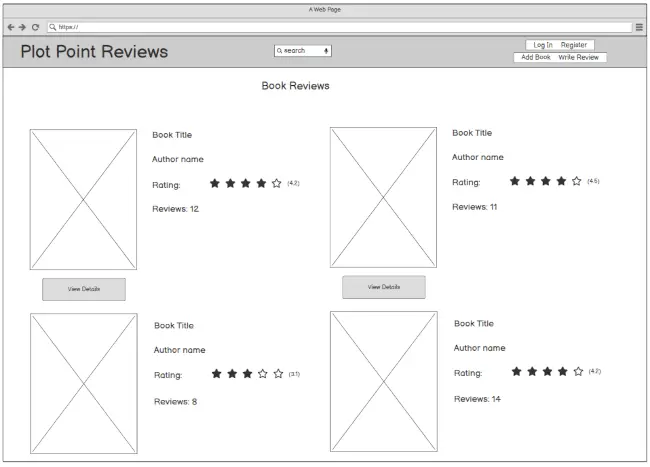
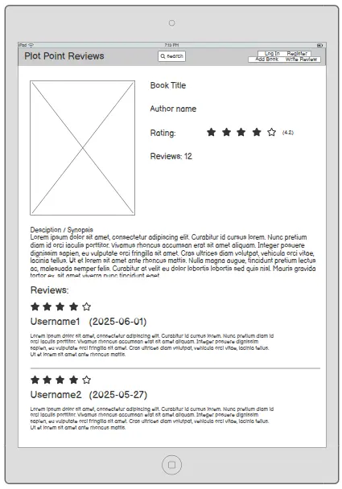
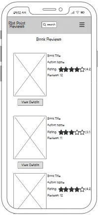

# Plot Point Reviews

Plot Point Reviews is a web application designed for book enthusiasts to discover, review, and discuss their favorite reads. Users can browse a curated list of books, read detailed reviews from fellow readers, and contribute their own ratings and opinions. The platform focuses on user-friendly navigation, accessibility, and fostering a community of engaged readers.

This project showcases a full-stack web application built with Python and Django, featuring a responsive front end and a backend with user authentication and data management.


## UX

The user experience prioritizes simplicity, clarity, and engagement. Visitors can easily browse the catalog, search for specific titles or authors, and access detailed reviews. Logged-in users can contribute their own reviews, add missing books, and manage their content, all through intuitive interfaces. The site also includes admin capabilities for content moderation and a responsive layout optimized for mobile, tablet, and desktop.

### Wireframes











### Colour Scheme

A dark-themed interface with contrasting light text, accented with muted colors for highlights and alerts.

### Typography

Uses Google Fonts with accessible font sizes and consistent hierarchy.

### Features

#### Existing Features

- Responsive navigation bar with login/logout and user-specific options

- Search functionality for books by title or author

- Paginated book list with cover, author, rating, and review count

- Book detail page with reviews and review form

- User registration and login/logout

- Add/edit/delete books and reviews

- Admin access for content moderation

#### Future Features

- Like/upvote reviews

- Book genres and filtering

- User profiles with review history

##  User Stories & Acceptance Criteria

### Site User

#### User Story: View Book List
**As a** Site User  
**I want to** see a list of books  
**so that** I can find something interesting to read or review.

**Acceptance Criteria:**
- A list displays the title, cover image, average rating, and number of reviews for each book.
- I can click on a book to view its detail page.

#### User Story: Read Reviews
**As a** Site User  
**I want to** read reviews  
**so that** I can decide whether a book is for me.

**Acceptance Criteria:**
- Reviews are visible on the book’s detail page.
- Each review includes the rating, review text, and the reviewer’s username.

#### User Story: Search for Books
**As a** Site User  
**I want to** search for books by title or author  
**so that** I can find specific books quickly.

**Acceptance Criteria:**
- I can use a search bar to enter a title or author.
- Matching results are displayed instantly.
- I see a message if no results are found.

---

### Logged-in User

#### User Story: Write a Review
**As a** logged-in user  
**I want to** write a review  
**so that** I can share my opinion about a book.

**Acceptance Criteria:**
- I can fill out a form with review text and a rating.
- My review appears on the book’s detail page after submission.
- I cannot submit more than one review for the same book.

#### User Story: Edit/Delete My Reviews
**As a** logged-in user  
**I want to** edit or delete my reviews  
**so that** I have control over my content.

**Acceptance Criteria:**
- I can see edit and delete buttons on my own reviews.
- I cannot edit or delete reviews written by other users.
- Updates are saved and reflected immediately.

#### User Story: Add New Books
**As a** logged-in user  
**I want to** add books that are missing  
**so that** I can review them.

**Acceptance Criteria:**
- I can submit a form with title, author, and a cover image.
- I receive an error message if the book already exists.
- The new book appears in the list after submission.

---

### Site Owner

#### User Story: Moderate Content
**As an** Site Owner  
**I want to** remove inappropriate reviews or books  
**so that** I can moderate the platform.

**Acceptance Criteria:**
- I can view and manage all books and reviews.
- I can delete any content that violates community guidelines.
- Regular users do not have access to these admin tools.

---

### New User

#### User Story: Register and Log In
**As a** New User  
**I want to** register and log in  
**so that** I can write reviews.

**Acceptance Criteria:**
- I can register using my email and password.
- I see relevant error messages if I enter incorrect data.
- After logging in, I can access review and book submission features.


# Database Design

## Entity relationship diagram

This Entity Relationship Diagram (ERD) illustrates the data structure of the book review web application. It shows how users can create reviews for books, and how books and reviews are linked through foreign key relationships.


I used [Lucidchart](https://www.lucidchart.com/) to create the ERD.

# Tools & Technologies

VSCode\
Python / Django\
HTML / CSS\
Bootstrap\
Cloudinary (for image hosting)\
GitHub\
Gimp (for image editing)\
[Cloudconvert](https://cloudconvert.com/png-to-webp) (for image conversion)

# Testing

Each user story has been tested manually to ensure it meets the stated acceptance criteria. Screenshots were taken to document successful execution.

### Site User

- View Book List: Verified display of book cards and navigation to detail page. 📸 Screenshot of homepage.

- Read Reviews: Checked review content and formatting. 📸 Screenshot of book detail with reviews.

- Search for Books: Tested valid and invalid queries. 📸 Screenshot of search results and 'no match' message.

### Logged-in User

- Write a Review: Submitted a new review and saw it appear. 📸 Screenshot of review form and result.

- Edit/Delete Reviews: Edited and deleted own review. 📸 Screenshot before and after actions.

- Add New Books: Added a book, saw it appear in the list, and tested duplicate error. 📸 Screenshot of form and feedback.

### New User

- Register/Login: Created new account, tested login/logout and error messages. 📸 Screenshots of registration and error states.

### Site Owner

- Moderate Content: Logged in as admin and removed inappropriate content. 📸 Screenshot of Django admin interface.

All features were also tested on different screen sizes to ensure responsive layout.

# Deployment

The site is deployed on [Heroku](https://plotpoint-reviews-a2e2369bb816.herokuapp.com/).

To deploy this project to Heroku:

1. Install required packages:

```
pip install gunicorn whitenoise dj-database-url python-decouple cloudinary cloudinary-storage
```

2. Create a Procfile in your project root with:

```
web: gunicorn plotpointreviews.wsgi
```

3. Create runtime.txt with the Python version, e.g.:

```
python-3.12.3
```

4. Set the following in your settings.py:

- STATIC_URL and STATIC_ROOT

- STATICFILES_STORAGE to 'whitenoise.storage.CompressedManifestStaticFilesStorage'

- Use dj_database_url and decouple to handle DATABASES and SECRET_KEY

- Configure Cloudinary credentials with os.getenv()

5. Create a .env file with:

```
SECRET_KEY=your-secret-key
DEBUG=False
CLOUDINARY_CLOUD_NAME=your-cloud-name
CLOUDINARY_API_KEY=your-api-key
CLOUDINARY_API_SECRET=your-api-secret
```

6. Set Heroku config vars matching your .env values:

```
heroku config:set SECRET_KEY=... DEBUG=False ...
```

7. Initialize a Git repository (if not already), commit your code, and push to Heroku:

```
git init
heroku git:remote -a your-app-name
git add .
git commit -m "Initial commit"
git push heroku main
```

8. Run migrations and create a superuser (optional):

```
heroku run python manage.py migrate
heroku run python manage.py createsuperuser
```

9. Collect static files:

```
heroku run python manage.py collectstatic --noinput
```

# Credits

- All book reviews are written by me
- Book desciptions and covers were sourced from Amazon or Goodreads